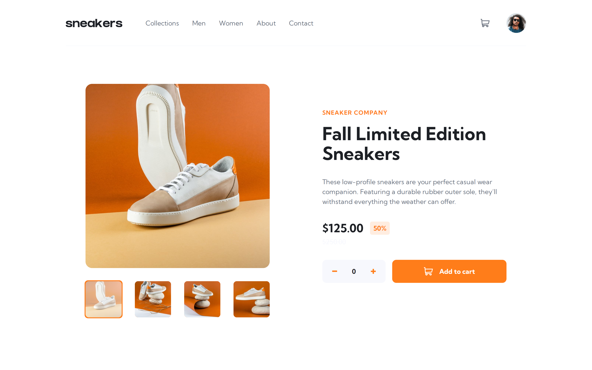

# Frontend Mentor - E-commerce product page solution

This is a solution to the [E-commerce product page challenge on Frontend Mentor](https://www.frontendmentor.io/challenges/ecommerce-product-page-UPsZ9MJp6). Frontend Mentor challenges help you improve your coding skills by building realistic projects.

## Table of contents

-   [Overview](#overview)
    -   [The challenge](#the-challenge)
    -   [Screenshot](#screenshot)
    -   [Links](#links)
-   [My process](#my-process)
    -   [Built with](#built-with)
    -   [What I learned](#what-i-learned)
    -   [Continued development](#continued-development)
    -   [Useful resources](#useful-resources)
-   [Author](#author)

## Overview

### The challenge

Users should be able to:

-   View the optimal layout for the site depending on their device's screen size
-   See hover states for all interactive elements on the page
-   Open a lightbox gallery by clicking on the large product image
-   Switch the large product image by clicking on the small thumbnail images
-   Add items to the cart
-   View the cart and remove items from it

### Screenshot

### Links

-   [Solution URL](https://github.com/c0dehamster/ecommerce-product-page-main)
-   [Live Site URL](https://ecommerce-product-page-main-virid.vercel.app/)

## My process

### Built with

-   Semantic HTML5 markup
-   CSS custom properties
-   Flexbox
-   CSS Grid
-   Mobile-first workflow
-   [Svelte](https://svelte.dev/) - JS framework
-   [Embla carousel](https://www.embla-carousel.com/) - a lightweight minimal carousel library

### What I learned

This challenge is my 1st attempt on a frontend mentor challenge marked as intermediate, and one of the few attempts to create am entire web page, not a stand-alone widget. It tested my uderstanding of page structure and loading functions in Sveltekit.

The challenge only gives one product and one page to work with, but I assumed there would be more than that on a real e-commerce site. This made my code a bit more complex but potentially re-usable in later projects.

### Continued development

The project in its current state should be treated as WIP. I used Embla carousel library for the slider but couldn't quite make it work in the lightbox dialog. The reason is likely display: none which does not allow the carousel to determine its dimensions until it is resized. If I find a fix for this problem, I will update my solution.

### Useful resources

-   [Using custom Svelte stores](https://dev.to/finiam/using-custom-svelte-stores-1dma) - a detailed guide to custom stores in Svelte
-   [Build an Ecommerce store with Sveltekit](https://youtu.be/7mUGqExgPdQ) - a tutorial for a project quite simular to this one, especially the part about the cart component
-   [Embla docs](https://www.embla-carousel.com/get-started/)

## Author

-   Frontend Mentor - [@twDevNoob](https://www.frontendmentor.io/profile/twDevNoob)
